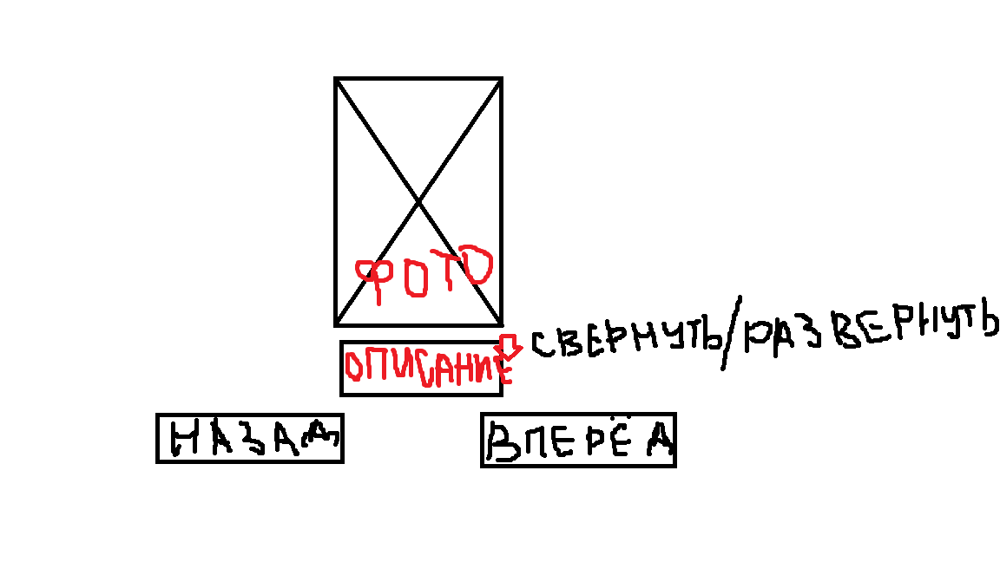
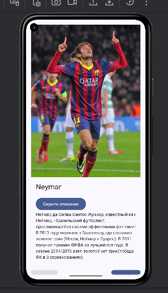

# Приложение с карточками футболистов
Приложение представляет собой карточки футболистов  с их фотографиями и краткой биографической справкой.
Пользователь может увидеть фотографию любимого игрока, прочитать биографическую справку (и свернуть ее обратно), а также переключаться между карточками футболистов.

## Реализованная функциональность
1. Кнопки переключения на следующее/предыдущее изображение (карточку)
2. Кнопка раскрыть/скрыть описание - при нажатии на кнопку открывается текстовое описание футболиста, а если описание уже раскрыто, то при нажатии на кнопку оно скрывается.

## Low-fi прототип
Изначально создавался простой графический прототип приложения. В итоговом варианте намеченные элементы сохранились и были реализованы.

## Использованные элементы
Приложение реализовалось на основе полученных знаний из предыдущих лабораторных работ (преимущественно из лабораторной №8). 
1. Column используется для вертикального расположения элементов на экране: изображения, имени игрока, кнопки показа/скрытия описания, самого описания и кнопок навигации(вперед/назад)
2. Image отображает фото футболиста, загружается с использованием `painterResource()` из папки `drawable`
3. Экран разбит на логические секции, каждая из которых реализована в виде отдельной компонуемой функции.

## Финальный вид приложения
Пример первой карточки игрока:

